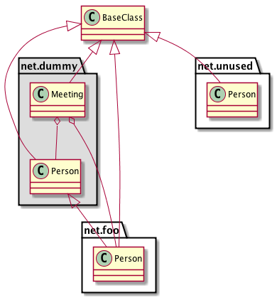

# Description
PlantUMLSublime is a plugin for sublime 3 to preveiw and export PlantUML diagram.
Support activity、sequence、class、component and state diagram.



# Install
```
CMD+SHIFT+P
choose 'Add Repository' and fill in 'https://github.com/amendgit/PlantUMLSublime.git'
'Install Package' and search 'PlantUMLSublime' to install.
```

# Usage
Using 'CMD+M'(Mac) or 'ALT+M'(Win or Linux) to preview the diagram file.
Using Command Palette to 'PlantUMLSublime' to export an diagram (png, txt or svg).

# PlantUML Syntax

Simple syntax highlighting for plantuml files form

FileTypes: *.puml


## Helper

Convert json to plist xml:
```
plutil -convert xml1 puml.tmLanguage.json -o puml.tmLanguage
```

Get list of plantuml keywords:
```
java -jar plantuml.jar -language
```

## Resources
https://github.com/jvantuyl/sublime_diagram_plugin
http://docs.sublimetext.info/en/latest/reference/syntaxdefs.html#compatibility-with-textmate
http://plantuml.sourceforge.net/developpers.html
http://manual.macromates.com/en/language_grammars
https://github.com/fluxsaas/sass-textmate-bundle/blob/master/Syntaxes/SASS.tmLanguage
https://github.com/Shammah/boo-sublime/blob/master/Boo.tmLanguage
